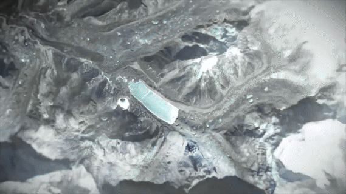

# 💫 About Me:

💼 I'm currently working on **Python**  
🤝 I'm looking to collaborate on **Python 🐍** and **Arduino** projects  
🌱 I'm currently learning **Python** and **AI**  
💬 Ask me about anything in the **Technology field**  
⚡ I know Python… but if you bring me a real snake, I’ll run faster than my code loops! 🏃‍♂️💨  

  <!-- This line ensures a break -->

## 🌐 Socials:
   

# 💻 Tech Stack:
         
# 📊 GitHub Stats:
 
 

## 🏆 GitHub Trophies

### ✍️ Random Dev Quote

### 🔝 Top Contributed Repo

---

<picture>
  <source media="(prefers-color-scheme: dark)" srcset="https://raw.githubusercontent.com/Nandhagopan-bits/Nandhagopan-bits/output/pacman-contribution-graph-dark.svg">
  <source media="(prefers-color-scheme: light)" srcset="https://raw.githubusercontent.com/Nandhagopan-bits/Nandhagopan-bits/output/pacman-contribution-graph.svg">
  
</picture>

<!-- Proudly created with GPRM ( https://gprm.itsvg.in ) -->
